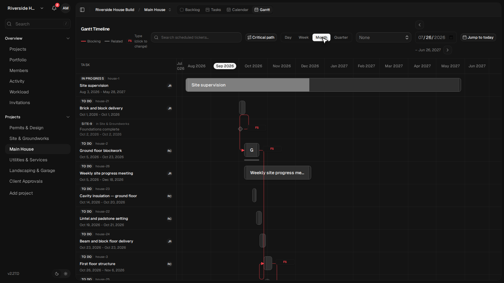
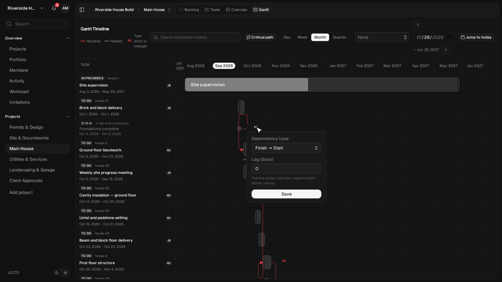
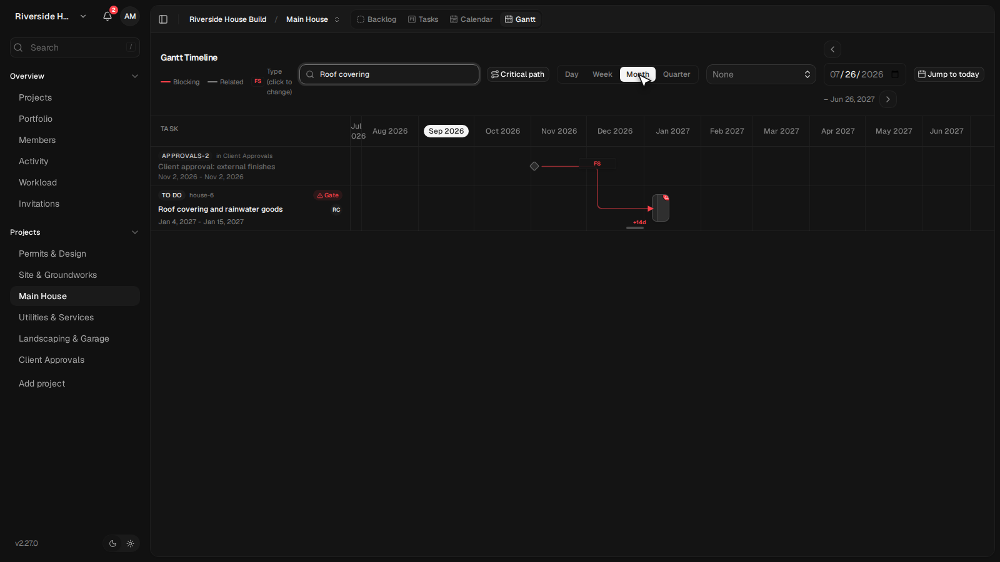
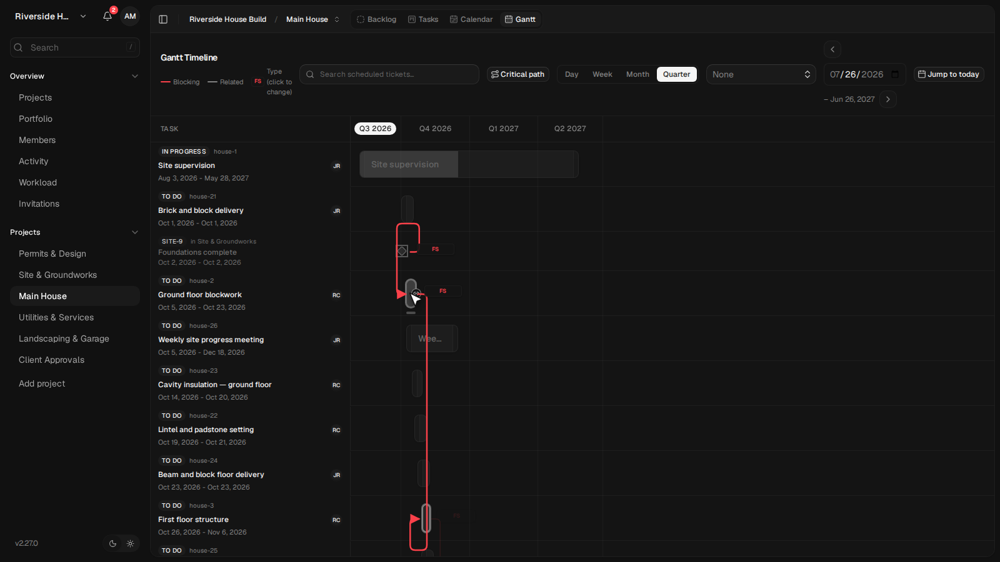
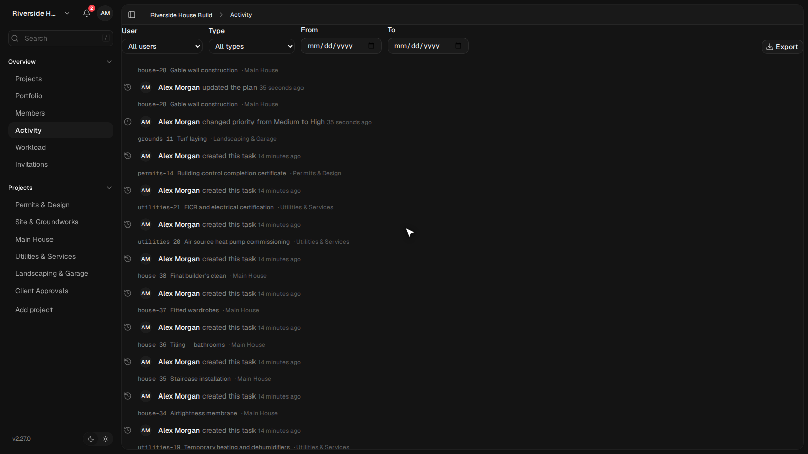
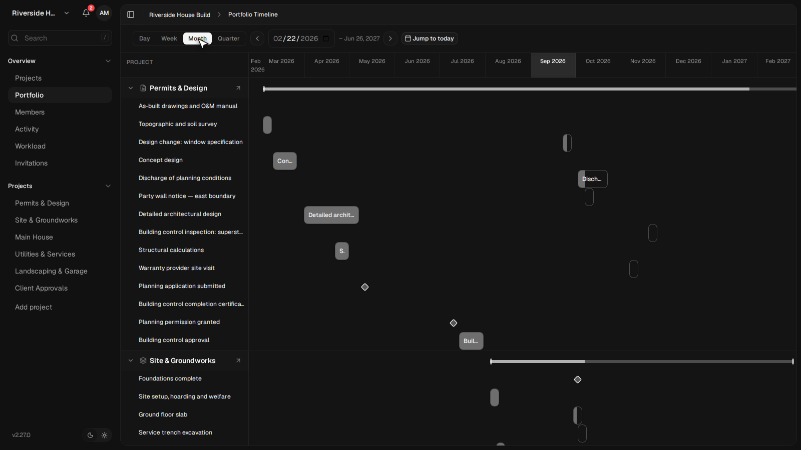
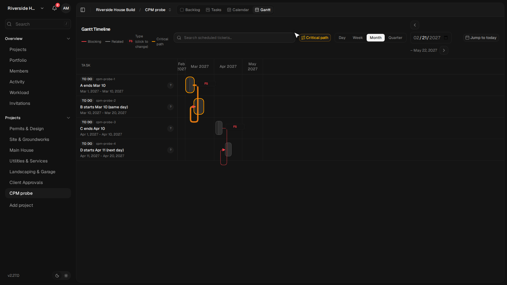
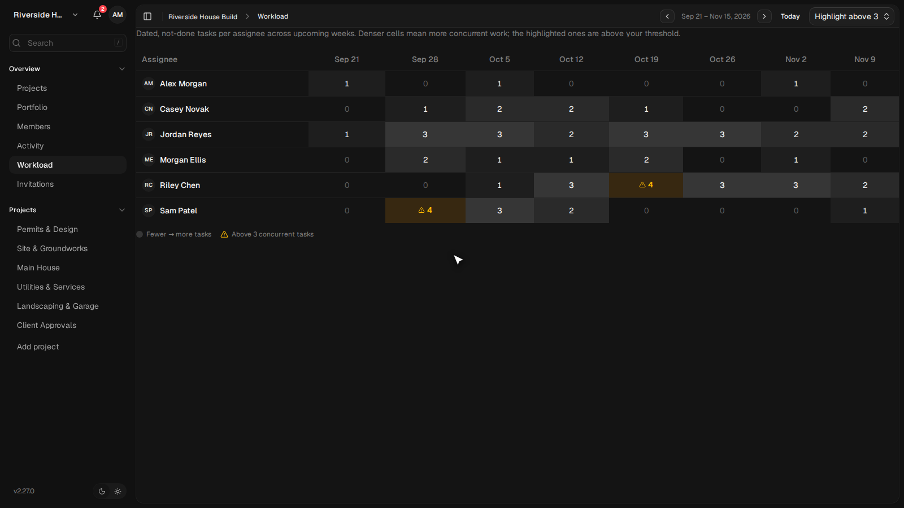

# Kaneo — przegląd gałęzi `claude/integration-all` dla maintainerów

Commit `555613a5`. Przebieg z 27 września 2026.
Lista poprawek z miejscami w kodzie: `POPRAWKI-KANEO.md`.

Poprzednie dwa raporty pisałem z perspektywy kierownika projektu. Ten jest dla
osób, które utrzymują kod: idzie funkcja po funkcji, podaje zmierzone liczby
i pokazuje też to, co działa tylko w połowie.

---

## 1. Dane testowe

Poprzedni zestaw — migracja 3000 maszyn wirtualnych — był zbyt konkretny, żeby
go pokazywać na zewnątrz. Zastąpiłem go **anonimowym planem budowy domu**:
108 zadań w 6 projektach, marzec 2026 – maj 2027, wszystko zmyślone, wszystko
po angielsku. Siedem kont, żadne nie odpowiada realnej osobie.

Zestaw jest dobrany tak, żeby każda funkcja miała co pokazać: cztery typy
zależności ze zwłokami, plan bazowy z odchyleniem w obie strony, trzy rodzaje
ograniczeń dat, sześć bramek zgody w czterech stanach, dni wolne, pola własne,
zadania podrzędne o różnym postępie i różnej długości oraz łańcuch przez
granicę projektu.

**Długości zadań są celowo rozrzucone** — od kamienia milowego (0 dni), przez
dostawę (1 dzień) i inspekcję (3 dni), po nadzór budowlany trwający 10 miesięcy.
To ujawniło pozycję C2 niżej.


*Skala Miesiąc. „Site supervision” ciągnie się przez dziesięć miesięcy, dostawa cegły to jeden dzień.*

Projekt do testu skali (1200 zadań) stoi w **osobnym obszarze roboczym**.
Trzymany razem z planem zalewał widok obłożenia (pozycja C3).

---

## 2. Co zamknięto od poprzedniego przebiegu

| # | Rzecz | Dowód z uruchomionej instancji |
|---|---|---|
| A1 | Okno typu zależności przetłumaczone | w interfejsie pl: „Typ zależności / Zakończenie → Rozpoczęcie / Zwłoka (dni) / Zapisz" |
| A2 | Pozostałe 18 języków | z 208 kluczy obszaru planowania po angielsku zostało: fr 14, zh 17, ja 21, de 23, nl 27 (było ~200) |
| A3 | Poślizg wobec planu bazowego | „+14d", opis „finishing 14d later than baseline"; „−7d" dla zadania przed planem |
| A4 | Ograniczenia dat | „Weathertight shell: Finish no later than, Jan 29" |
| A5 | Ostrzeżenie o bramce zgody | „1 unapproved gate blocking this task" |
| A6 | **Postęp słupka zbiorczego liczony wagą czasu** | dzieci 10 dni @ 75 % i 9 dni @ 20 % → rodzic `width: 48.9474%`. Średnia prosta dałaby 47,5 %, ważona (10·75+9·20)/19 = 48,947 %. W poprzednim raporcie zaznaczyłem, że tego nie potwierdziłem — teraz jest potwierdzone |
| A7 | Podświetlanie po najechaniu w skali Kwartał | 28 linii przygaszonych, 2 pogrubione, 13 słupków wyblakłych |
| A8 | Znacznik „Overdue" | obecny |
| A9 | Wirtualizacja wierszy | 1200 zadań → 10–24 słupki w DOM, 1669 elementów DOM ogółem |
| A10 | **Kontrast cieniowania dni wolnych — zmierzony** | tło kolumny `oklab(0.97 0 0 / 0.1)` na 26 kolumnach. Poprzednio pisałem, że znam tylko zmianę w kodzie (0,06 → 0,1); teraz jest pomiar na ekranie |
| A11 | Ślad audytowy w danych | `updated` niesie `changes` z wartościami przed/po dla `startDate`, `dueDate`, `progress`; zmiana priorytetu tworzy własne `priority_changed` |
| A12 | Walidacja MCP | `update_task` z gołą datą zamiast pełnego znacznika ISO zwraca `isError: true` i „Invalid ISO datetime at startDate" — dokładnie takie zachowanie, jakiego oczekuję |
| A13 | **Zależności międzyprojektowe na wykresie projektu** | 16 powiązań blokujących przecina granicę projektu; wykres wciąga drugi koniec każdego z nich jako wiersz zewnętrzny — wyszarzony, z nazwą projektu właściciela, ze statusem tylko do odczytu w karcie zadania |


*Typ i zwłoka edytowane wprost z wykresu.*


*Pasek planu bazowego pod słupkiem i etykieta „+14d”.*


*Najechanie kursorem w skali Kwartał: zostają tylko linie dotyczące zadania.*

---

## 3. Co nadal otwarte

### B1. MCP po cichu połyka status zgody

47 narzędzi, żadnego dotyczącego bramek zgód.

```
update_task {"taskId":"…","approvalStatus":"approved","approvalNote":"set over MCP"}
→ isError: false, zwrócony pełny obiekt zadania
→ baza: approval_status = none, approval_note = null
```

To jest ten sam wzorzec, który naprawiono dla `dependencyType` i `progress`.
Kontrast z A12 jest wymowny: błędna data dostaje precyzyjny komunikat,
a pole, które nic nie zapisuje, dostaje potwierdzenie sukcesu.

### B2. Eksport bez statusu zgody

16 pól. Brak `approvalStatus` i `approvalNote`. Przypisanie wychodzi tylko
jako `userId`, bez nazwiska.

### B3. Dziennik nie renderuje `eventData.changes`


*Ten sam ekran, ta sama sekunda. Jeden wiersz podaje wartości, drugi nie.*

Dwa wiersze zapisane w tej samej sekundzie tą samą operacją:

```
Alex Morgan changed priority from Medium to High
Alex Morgan updated the plan
```

Renderer obsługuje dedykowane typy zdarzeń i pomija `changes` przy zdarzeniu
ogólnym. Dane są kompletne. To najtańsza poprawka o największym skutku.

Filtr typów ma tę samą lukę — lista to Comment, Created, Moved, Status
changed, Priority changed, Assignee changed, Unassigned, Due date changed,
Title changed, Description changed. Brak `updated`, `approval_changed`
i `relation_*`. Filtra projektu nie ma wcale.

### B4. Portfel bez linii zależności


*Sześć projektów na jednej osi, ani jednej linii relacji.*

Sześć projektów na jednej osi, zero linii relacji. W planie jest 16 zależności
międzyprojektowych. Wykres pojedynczego projektu rysuje je
poprawnie jako wiersze zewnętrzne; portfel nie. Punkt końcowy portfela nie zwraca relacji, więc nie jest to
kwestia rysowania.

### B5. 1200 zadań to 13 żądań


*Wirtualizacja trzyma w DOM kilkanaście słupków zamiast tysiąca dwustu.*

Stronicowanie po 100 przy każdym wejściu. Wirtualizacja rozwiązała renderowanie,
nie pobieranie.

---

## 4. Nowe ustalenia

### C1. Ścieżka krytyczna daje wynik odwrotny do zamierzonego


*Cztery zadania, dwie pary FS. Para z przekazaniem tego samego dnia jest bursztynowa — krytyczna. Para z przekazaniem nazajutrz zostaje czerwona.*

Na planie budowy przełącznik podświetla **21 zadań — wyłącznie takich, które
nie mają żadnej zależności** (dostawy, inspekcje, nadzór). **Ani jedno zadanie
z łańcucha zależności nie jest podświetlone.**

Eksperyment kontrolny na osobnym projekcie, dwie pary zadań z relacją FS:

| Układ | Wynik |
|---|---|
| A kończy 10 mar, B zaczyna **10 mar** (ten sam dzień) | oba **krytyczne** |
| C kończy 10 kwi, D zaczyna **11 kwi** (nazajutrz) | **żadne** |

Składają się na to dwie reguły, obie udokumentowane w `gantt-critical-path.ts`:

1. `forwardRequiredStart` dla FS zwraca `sourceEF + lagDays`, więc powiązanie
   jest „napięte" tylko wtedy, gdy następnik startuje **w dniu zakończenia**
   poprzednika. Przekazanie nazajutrz to 1 dzień luzu, z piątku na poniedziałek
   — 3 dni. **Kalendarz roboczy nie jest tu uwzględniany**, choć wykres go zna.
2. Zadanie bez krawędzi jest z rozmysłem traktowane jako krytyczne
   (*„A lone task … is trivially critical"*).

Osobno każda reguła jest obroniona. Razem dają narzędzie, które w planie
wpisanym ręcznie pokazuje dokładnie to, czego PM nie szuka.

Sugestia: liczyć luz w dniach roboczych z kalendarza obszaru, a zadania bez
żadnej krawędzi wyłączyć z podświetlenia albo oznaczyć inaczej niż łańcuch.

### C2. W skali Miesiąc każde zadanie do ~10 dni rysuje się tak samo

Zmierzone szerokości rysowanego słupka, okno 1600 px, 12 miesięcy ≈ 2,88 px/dzień:

| Zadanie | Długość | Słupek |
|---|---|---|
| Brick and block delivery | 1 dzień | 20 px |
| Lintel and padstone setting | 3 dni | 20 px |
| Cavity insulation | 5 dni | 20 px |
| Ground floor blockwork | 15 dni | 30 px |
| Weekly site progress meeting | 74 dni | 195 px |
| Site supervision | 298 dni | 857 px |

Komentarz w `gantt-task-bar.tsx` przy `MIN_BAR_HOVER_HIT_PX` mówi, że minimum
20 px poszerza wyłącznie obszar trafienia, a *„the visible bar inside still
renders at its own (possibly narrower) computed width"*. Pomiar tego nie
potwierdza: dla zadania 5-dniowego kontener rysowany ma 13 px, ale widoczny
przycisk w środku — 20 px.

W skali Tydzień proporcje są poprawne (5 dni = 66 px, 15 dni = 223 px).

To jest zarazem powód, dla którego **widok portfela otwierany domyślnie
w skali Kwartał pokazuje wszystkie zadania jako jednakowe pigułki**.

### C3. Obłożenie zasobów i dziennik bez filtra projektu


*Po przeniesieniu piaskownicy do osobnego obszaru tabela pokazuje realny tydzień na budowie.*

Projekt z 1200 zadaniami w tym samym obszarze roboczym dał w obłożeniu wiersz
„Unassigned" z wartościami 71–91 i przykrył cały zespół. Ten sam brak dotyczy
dziennika aktywności.

---

## 5. Kolejność, w jakiej bym to brał

1. **Ścieżka krytyczna** (C1) — funkcja jest, ale dziś wprowadza w błąd.
2. **`eventData.changes` w widoku dziennika** (B3) — dane są, renderer ich nie
   używa; najtańsza poprawka o największym skutku.
3. **Bramki zgód w MCP i w eksporcie** (B1, B2) plus odznaka statusu na rombie
   kamienia milowego.
4. **Linie zależności w portfelu** (B4).
5. **Próg 20 px** (C2) — albo skalowany do jednostki czasu, albo obszar
   trafienia oddzielony od rysunku, tak jak zakłada komentarz w kodzie.

---

## 6. Czego nie sprawdziłem

1. Obrazu Dockera — polityka ruchu wychodzącego sesji blokuje magazyn warstw
   GHCR. Testowałem kod z gałęzi.
2. Redisa i wielu instancji API — jedna instancja, adapter w pamięci.
3. Urządzeń dotykowych — wyłącznie Chromium 1600 × 900.
4. Skali powyżej 1200 zadań.
5. Egzekwowania retencji dziennika w czasie.
6. Integracji GitHub, GitLab i Slack oraz powiadomień e-mail.

---

## Załącznik — jak odtworzyć

```bash
git checkout claude/integration-all        # commit 555613a5
pg_ctlcluster 16 main start
pnpm install && pnpm dev                   # API 1337, aplikacja 5173
```

Plan demonstracyjny zasiewają skrypty z katalogu roboczego sesji:
`bootstrap3.mjs` (konta i obszar), `seed3.mjs` (63 zadania, relacje, plan
bazowy, ograniczenia), `finish3.mjs` (bramki zgód, dni wolne), `fields3.mjs`
(pola własne), `detail3.mjs` (45 czynności równoległych), `scale3seed.mjs`
(1200 zadań w osobnym obszarze). `restore3.mjs` cofa daty po teście z przeciąganiem — kaskada trwale przesuwa
następniki.

Sesję MCP po HTTP otwiera sekwencja `initialize` → `notifications/initialized`
→ `tools/call` z nagłówkiem `mcp-session-id` i tokenem sesji w `Authorization:
Bearer`.

---

*Liczby pochodzą z pomiarów na uruchomionej instancji: z DOM, z odpowiedzi API,
z sesji MCP albo z zapytań do bazy. Raport jest materiałem pomocniczym —
przed decyzją wymaga weryfikacji przez właściciela produktu.*
