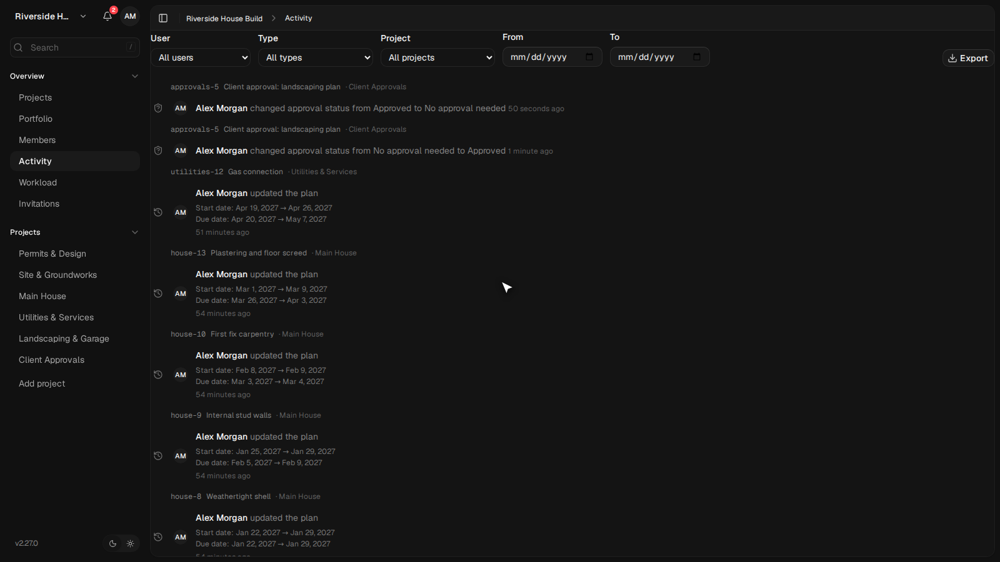
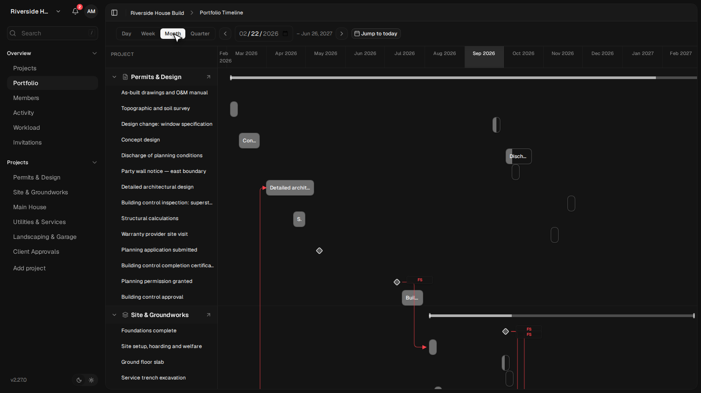
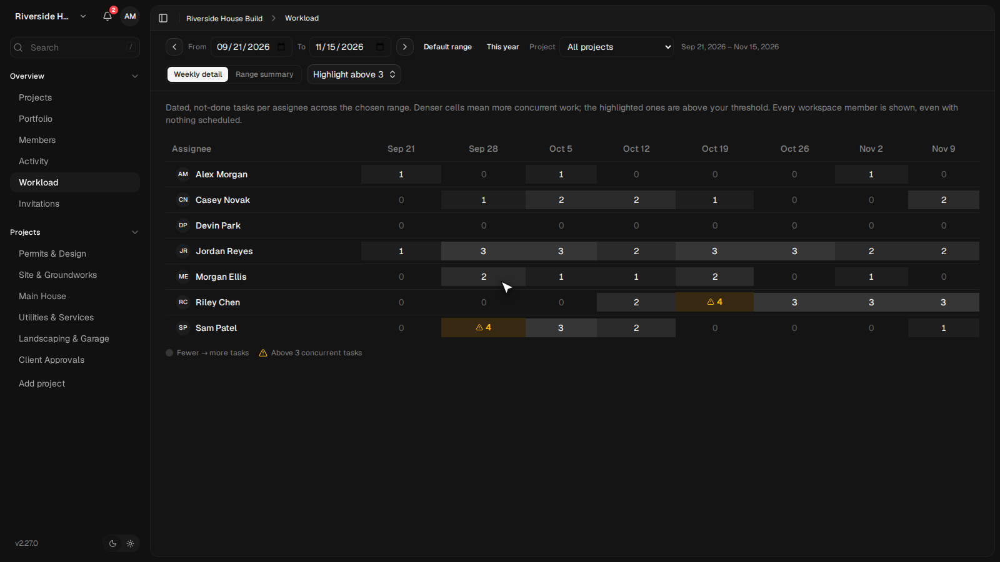
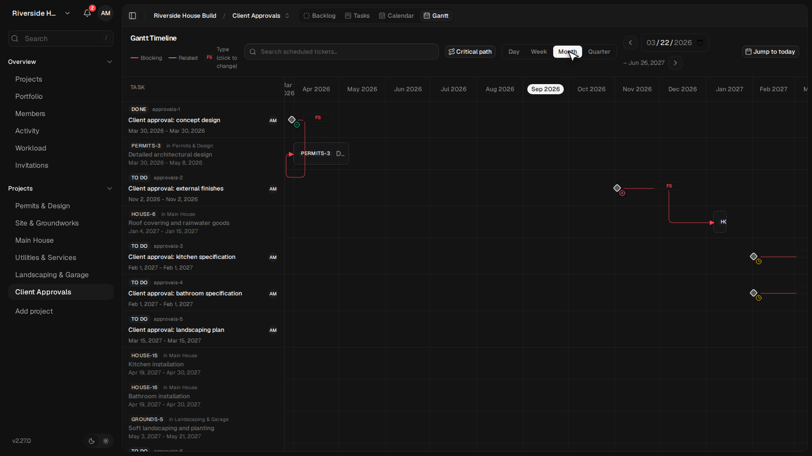

# Kaneo — raport po poprawkach, commit `05cb1251`

Sprawdzenie listy z `POPRAWKI-KANEO.md` na gałęzi `claude/integration-all`
po 11 nowych commitach. Do tego problemy, na które trafiłem przygotowując
nagranie tutoriala.

Nagrania nie ma — przerwane na polecenie, żeby najpierw domknąć poprawki.

**Bilans: 10 pozycji zamkniętych, 1 zamknięta połowicznie, 2 otwarte,
1 drobiazg. Jeden mój wcześniejszy zarzut wycofuję jako nietrafny.**

---

## 1. Zamknięte

| # | Pozycja | Dowód z uruchomionej instancji |
|---|---|---|
| 1 | **`eventData.changes` w widoku dziennika** | wpis brzmi teraz: „updated the plan **Start date: Apr 19, 2027 → Apr 26, 2027. Due date: Apr 20, 2027 → May 7, 2027**" |
| 2 | **Filtr typów w dzienniku** | 18 typów zamiast 10; doszły `updated`, `approval_changed`, `relation_created/updated/deleted`, `calendar_updated`, `holiday_added/removed` |
| 3 | **Filtr projektu w dzienniku** | trzeci selektor „All projects" obok użytkownika i typu |
| 4 | **Walidacja MCP** | **47 z 47** narzędzi publikuje `additionalProperties: false`; `update_task {"zupelnieNieistniejacePole":1}` → `isError: true`, „Unrecognized key" |
| 5 | **Bramki zgód w MCP** | `update_task {approvalStatus:"approved", approvalNote}` → w bazie `approved` / notatka; pole opisane w schemacie jako wywołujące ten sam punkt końcowy co REST |
| 6 | **Bramki zgód w eksporcie** | 19 pól zamiast 16; doszły `approvalStatus`, `approvalNote` oraz **`assigneeName`** (wcześniej było tylko `userId`) |
| 7 | **Odznaka statusu zgody na kamieniu milowym** | 4 odznaki na rombach w projekcie Client Approvals: Approved, Rejected, 2 × Pending. Wcześniej selektor zwracał 0 |
| 8 | **Linie zależności w portfelu** | linie z etykietami FS przecinają granice projektów — widać powiązanie „Planning permission granted" → „Site setup, hoarding and welfare" między dwoma projektami |
| 9 | **Obłożenie zasobów** | doszły: zakres dat od/do, „Default range" i „This year", **filtr projektu**, przełącznik „Weekly detail / Range summary", i **wszyscy członkowie obszaru, także bez zadań** (Devin Park z samymi zerami) |
| 10 | **Liczba żądań na 1200 zadań** | 13 → **4** (`BOARD_PAGE_LIMIT` 100 → 500) |

*Zmiana harmonogramu renderuje teraz każde pole osobno, z wartością przed i po.*

*Linie zależności przecinają granice projektów; przy każdej etykieta typu.*

*Zakres dat, filtr projektu, widok zbiorczy i wszyscy członkowie — także bez zadań.*

*Status bramki widoczny na rombie, nie tylko na zwykłym słupku.*

Przy okazji zamknęły się dwie rzeczy z listy „drobne":

- **Retencja dziennika jest egzekwowana** — doszedł
  `apps/api/src/scheduler/activity-retention.ts` podpięty do harmonogramu.
- **Tłumaczenia.** W obszarze planowania (244 klucze) po angielsku zostało:
  polski 13, francuski 17, chiński 20, niemiecki 26, niderlandzki 31.
  Z 13 polskich dziewięć to wzorce formatowania i skróty FS/SS/FF/SF;
  realnie zostaje „Portfolio" w pasku bocznym i trzy wzorce z interpolacją.

---

## 2. Zamknięte połowicznie — jedna pozycja

### Ścieżka krytyczna podświetla teraz **zero zadań**

**Co się zmieniło.** Poprawka usunęła szum: zadanie bez żadnej krawędzi nie
jest już raportowane jako krytyczne (`gantt-critical-path.ts`, komentarz
„it is NOT reported as critical"). To była połowa problemu i jest zrobiona
dobrze.

**Co zostało.** Luz nadal liczony jest w **dniach kalendarzowych**.
Eksperyment kontrolny, dwie pary zadań z relacją FS bez zwłoki:

| Układ | Wynik |
|---|---|
| A kończy 10 mar, B zaczyna **10 mar** (ten sam dzień) | oba **krytyczne** |
| C kończy 10 kwi, D zaczyna **11 kwi** (nazajutrz) | **żadne** |

Powiązanie jest „napięte" tylko wtedy, gdy następnik startuje w dniu
zakończenia poprzednika. Przekazanie prac nazajutrz to 1 dzień luzu,
z piątku na poniedziałek — 3 dni. W planie „Riverside House Build"
(108 zadań, 16 powiązań międzyprojektowych) takich przekazań są dziesiątki,
więc **żaden łańcuch nie wychodzi krytyczny i przełącznik nie podświetla nic**.

**Dlaczego to jest teraz gorsze niż przed poprawką.** Wcześniej narzędzie
pokazywało coś nietrafionego — użytkownik widział, że coś nie gra. Teraz nie
pokazuje nic i nie da się odróżnić usterki od planu, który faktycznie ma
wszędzie zapas.

**Propozycja.** Liczyć luz w dniach roboczych z kalendarza obszaru.
`gantt-working-calendar.ts` już istnieje i jest używany przez kaskadę
auto-przeplanowania — ta sama funkcja wystarczy w przebiegu naprzód i wstecz
w `gantt-critical-path.ts`. Wtedy przekazanie z piątku na poniedziałek to
zero luzu, czyli to, co PM rozumie przez „napięte".

---

## 3. Otwarte

### 3.1. Próg 20 px spłaszcza wszystkie krótkie zadania

Zmierzone szerokości **rysowanego** słupka, okno 1600 px, widok dwunastu
miesięcy (≈ 2,88 px/dzień):

| Zadanie | Długość | Słupek |
|---|---|---|
| Brick and block delivery | 1 dzień | 20 px |
| Lintel and padstone setting | 3 dni | 20 px |
| Cavity insulation | 5 dni | 20 px |
| Ground floor blockwork | 15 dni | 30 px |
| Weekly site progress meeting | 74 dni | 195 px |
| Site supervision | 298 dni | 857 px |

Źródło: `MIN_BAR_HOVER_HIT_PX = 20` w `timeline.ts`, użyte w
`gantt-task-bar.tsx`. Komentarz przy stałej mówi, że minimum poszerza
wyłącznie obszar trafienia, a widoczny słupek rysuje się węziej. Pomiar tego
nie potwierdza: dla zadania 5-dniowego kontener rysowany ma 13 px,
ale przycisk w środku 20 px — rozciąga się do szerokości rodzica.

**Propozycja.** Oddzielić obszar trafienia od rysunku tak, jak zakłada
komentarz: przezroczysta warstwa 20 px wokół słupka o właściwej szerokości.

**Uwaga.** Druga część tego zgłoszenia jest **naprawiona**: strefy uchwytów
zostały rozdzielone. Zmierzone na słupku: uchwyt zmiany długości 1455–1463 px,
kropka relacji 1469–1485 px — nie nachodzą na siebie.

### 3.2. Zadania da się dodać tylko spoza wykresu

Na wykresie Gantta nie ma sposobu dodania zadania — trzeba przejść na tablicę
albo do listy i wrócić. To nie jest błąd, tylko brak, ale przy budowaniu planu
od zera oznacza kilkanaście przełączeń widoku. W narzędziu, którego wykres
jest głównym widokiem planowania, przycisk na osi czasu oszczędziłby
najwięcej klikania właśnie przy pierwszym kontakcie.

Wyszło przy Akcie 1 tutoriala, w którym plan powstaje na oczach widza.

---

## 4. Drobiazg

### Kalendarz wyboru daty nie zamyka się po wybraniu dnia

W oknie „Add task" po kliknięciu „Start date" i wybraniu dnia popover
z kalendarzem **zostaje otwarty**. Data zapisuje się poprawnie (przycisk
pokazuje „Sep 15, 2026" i pojawia się „Clear start date"), ale kalendarz
wisi nad oknem, dopóki użytkownik nie kliknie gdzie indziej.

Sprawdzone: **nie blokuje** ani „Due date", ani „Create Task" — oba kliknięcia
przechodzą. To wyłącznie niedomknięty popover.

**Propozycja.** Zamknąć popover po wyborze dnia.

---

## 5. Wycofuję własny zarzut

W roboczej wersji tej listy napisałem, że otwarty kalendarz **zasłania
przycisk „Create Task" i uniemożliwia zapisanie zadania**. To nieprawda.
Sprawdziłem punktowo przez `elementFromPoint`: przycisk nie jest zasłonięty,
a kliknięcie się udaje.

Pierwsze podejście do nagrania rzeczywiście wywróciło się w tym miejscu,
ale winny był **mój selektor nawigacji po miesiącach** w skrypcie nagrywającym,
nie aplikacja. Po poprawieniu selektora wszystkie 22 sceny przechodzą.

Osobno wycofuję zarzut o **domyślnej skali portfela**: kod ogranicza teraz
automatyczny dobór do Miesiąca, z komentarzem wprost o tym, że w Kwartale
„every task collapses to the same minimum-width pill". Moja wcześniejsza
obserwacja dotyczyła poprzedniego commita.

---

## 6. Co proponuję zrobić

| Kolejność | Pozycja | Dlaczego |
|---|---|---|
| 1 | Ścieżka krytyczna — luz w dniach roboczych | jedyna funkcja, która po poprawkach nadal nie działa na realnym planie; kalendarz roboczy już jest w kodzie |
| 2 | Próg 20 px — rozdzielić rysunek od obszaru trafienia | psuje czytelność każdego planu w skali Miesiąc, czyli w skali domyślnej |
| 3 | Zamykanie kalendarza po wyborze daty | jednoliniowa, trafia każdego przy pierwszym zadaniu |
| 4 | Przycisk dodania zadania na wykresie | brak, nie błąd — do decyzji produktowej |

Po zamknięciu pozycji 1 i 3 nagranie tutoriala pójdzie bez zastrzeżeń:
skrypt jest gotowy, 22 sceny przechodzą, scenariusz z oznaczeniami funkcji
jest w `SCENARIUSZ-TUTORIAL.md`.

---

*Liczby pochodzą z pomiarów na uruchomionej instancji: z DOM, z odpowiedzi API,
z sesji MCP albo z zapytań do bazy. Wnioski z samego kodu są oznaczone
odwołaniem do pliku. Materiał jest pomocniczy — przed decyzją wymaga
weryfikacji przez właściciela produktu.*

---

# Aneks — commit `9ac09299`

Pięć kolejnych commitów. Dwie pozycje z listy wyżej zamknięte, film nagrany.

## Ścieżka krytyczna — zamknięta

`76d5e6a9 fix(gantt): measure critical-path slack in working days`.
Wprowadza `FS_HANDOFF_DAYS = 1` (powiązanie FS jest napięte, gdy następnik
zaczyna się **następnego dnia roboczego**, a nie tego samego) i liczy indeksy
dni przez `makeWorkingDayIndexer` z kalendarza obszaru.

Eksperyment kontrolny, trzy pary zadań z relacją FS bez zwłoki:

| Układ | Wynik |
|---|---|
| A kończy czw 11 mar, B zaczyna pt 12 mar (następny dzień roboczy) | oba **krytyczne** |
| C kończy pt 12 mar, D zaczyna pon 15 mar (**przez weekend**) | oba **krytyczne** |
| E kończy czw 8 kwi, F zaczyna czw 15 kwi (tydzień przerwy) | **żadne** |

Na planie „Riverside House Build" podświetla się **22 ze 108 zadań** i jest to
łańcuch w kolejności: blockwork → strop → ściany piętra → więźba → krycie →
okna → weathertight shell → ścianki → stolarka → tynki → druga stolarka →
kuchnia i łazienka → podłogi → usterki → odbiór. Do tego „Site supervision",
które ciągnie się przez cały projekt i faktycznie ma zerowy zapas.

Sprawdzone punktowo, że zadania **bez** zależności nie są oznaczane:
„Brick and block delivery", „Steel beam installation", „Staircase
installation", „Weekly site progress meeting" — wszystkie zwykłe.

## Kalendarz daty — zamknięty

`09e08367 fix(tasks): close the date calendar popover after picking a day`.
Popover jest teraz sterowany stanem i zamyka się po wyborze dnia.
Zmierzone: otwarty przed wyborem `true`, po wyborze `false`.

**Skutek uboczny dla mojego skryptu.** Miałem w nim obejście wymuszające
Escape po wyborze daty. Gdy aplikacja zaczęła zamykać popover sama, ten
Escape zamykał całe okno tworzenia zadania i wywracał dwie sceny Aktu 1.
Usunąłem obejście. To problem mojego kodu, nie aplikacji — odnotowuję, bo
jest bezpośrednim skutkiem poprawki i ktoś inny może na to trafić tak samo.

## Co zostaje

| Pozycja | Stan |
|---|---|
| Próg 20 px w skali Miesiąc | **otwarte**, bez zmian — zmierzone ponownie: 1, 3 i 5 dni to nadal 20 px, 15 dni 30 px |
| Dodawanie zadania z poziomu wykresu | **otwarte**, brak, nie błąd |

Żadna z tych dwóch nie blokowała nagrania.

## Film

`demo-kaneo-tutorial.mp4` — **11 minut 55 sekund**, 1600 × 900, H.264, 10 MB.
22 sceny, pięć aktów, zero nieudanych kroków. Nagrane w jednym przebiegu na
commicie `9ac09299`.

Akt 1 buduje plan od zera w pustym projekcie „Garden Room": zadanie z datami,
zależność przeciągnięciem uchwytu, kamień milowy ze zwłoką, zmiana typu
relacji z poziomu wykresu. Akty 2–5 pracują na pełnym planie Riverside.
Prompty do agenta są widoczne w panelu po prawej razem z listą wywołań MCP.

Scenariusz z oznaczeniami funkcji: `SCENARIUSZ-TUTORIAL.md`.
