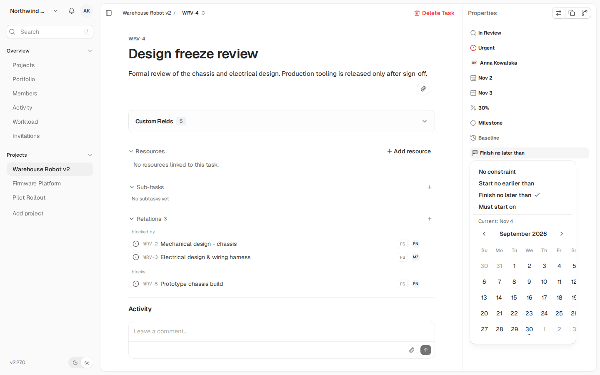

<h1 align="center">Kaneo Pro</h1>

<p align="center">
  <b>kaneo-pro</b> to fork projektu <a href="https://github.com/usekaneo/kaneo">Kaneo</a>.<br />
  Dodaje planowanie w stylu Gantt Pro, widoki całego obszaru roboczego i dostęp do danych na poziomie projektu.
</p>

<div align="center">

[](LICENSE)
[](https://github.com/usekaneo/kaneo)

</div>

<p align="center">
  
</p>

## Czym jest Kaneo Pro

Kaneo to prosta platforma do zarządzania projektami, którą instalujesz na własnym serwerze. Kaneo Pro zachowuje tę bazę: tablicę, listę, zadania, integracje, MCP i wdrożenie Docker/Helm. Fork dodaje funkcje dla zespołów, które planują pracę w czasie i dzielą obszar roboczy między wiele projektów i osób.

Ten dokument opisuje tylko **różnice** między Kaneo a Kaneo Pro. Instrukcje wspólne dla obu wersji są w [oryginalnym README Kaneo](https://github.com/usekaneo/kaneo#readme) i w [dokumentacji Kaneo](https://kaneo.app/docs/core).

Zrzuty ekranu w tym dokumencie pokazują fikcyjne dane testowe (firma „Northwind Robotics”).

Stan na 30.09.2026: fork ma około 300 własnych commitów ponad bazę upstream z 26.09.2026. Zmiany z upstream trafiają do forka przez cotygodniowy pull request (zobacz [Utrzymanie forka](#utrzymanie-forka)).

## Porównanie w skrócie

| Obszar | Kaneo (upstream) | Kaneo Pro |
| --- | --- | --- |
| Wykres Gantta | Paski zadań na osi czasu | Linie zależności, typy FS/SS/FF/SF z opóźnieniem, ścieżka krytyczna, postęp, kamienie milowe, plan bazowy, paski podsumowania podzadań, automatyczne przesuwanie zależnych zadań, ograniczenia dat, przesuwanie i przybliżanie osi, skala Dzień/Tydzień/Miesiąc/Kwartał, wirtualizacja wierszy |
| Zależności między projektami | Brak | Powiązania `blocks` między projektami jednego obszaru roboczego, ścieżka krytyczna przez granice projektów, blokada cykli |
| Widoki obszaru roboczego | Brak | Portfolio (oś czasu wszystkich projektów), Obciążenie (workload), Aktywność z eksportem CSV/JSON |
| Kalendarz pracy | Brak | Dni robocze i święta obszaru roboczego, cieniowanie na wykresie Gantta |
| Pola niestandardowe | Na poziomie projektu | Także na poziomie obszaru roboczego, z dziedziczeniem i ukrywaniem w projekcie, kolory opcji, kolumna i kolorowanie na wykresie Gantta |
| Osoby przypisane | Jedna osoba | Wiele osób, także zasoby bez konta (osoba, sprzęt, materiał) |
| Bramki akceptacji | Brak | Status akceptacji z notatką na zadaniu, ostrzeżenia na wykresie Gantta |
| Dostęp do danych | Każdy członek obszaru roboczego widzi wszystkie projekty | Członkostwo w projekcie z rolą projektu, zaproszenia do projektu, filtrowanie list, wyszukiwania, powiadomień i WebSocket |
| Dodawanie osób | Zaproszenie e-mailem | Jedno okno „Add people”: zaproszenie albo dodanie istniejącego konta bez zaproszenia |
| Narzędzia MCP | Zadania, projekty, etykiety | Dodatkowo: pola niestandardowe, plan bazowy, wiele osób przypisanych, typy zależności, kalendarz pracy |
| Tłumaczenia | Interfejs w wielu językach | Nowe funkcje przetłumaczone we wszystkich językach; e-mail o dodaniu do obszaru roboczego po angielsku i po polsku |

## Funkcje Kaneo Pro

### 1. Wykres Gantta

Wykres Gantta w Kaneo Pro jest narzędziem do planowania, nie tylko do podglądu dat.

- **Linie zależności.** Wykres rysuje powiązania `blocks` między zadaniami. Aby utworzyć zależność, przeciągnij uchwyt z paska jednego zadania na drugie.
- **Typy zależności.** Każda zależność ma typ FS, SS, FF albo SF i opóźnienie w dniach (lag). Typ jest widoczny na wykresie i można go zmienić.
- **Automatyczne przesuwanie.** Gdy przesuwasz lub zmieniasz długość zadania, aplikacja przesuwa zadania zależne do przodu. Zależne zadanie trafia na dzień roboczy.
- **Ścieżka krytyczna.** Wykres wyróżnia ścieżkę krytyczną. Zapas czasu jest liczony w dniach roboczych. Ścieżka przechodzi także przez zadania z innych projektów.
- **Postęp i kamienie milowe.** Zadanie ma postęp w procentach (także zmiana wielu zadań naraz). Zadanie może być kamieniem milowym.
- **Plan bazowy.** Zapisz plan bazowy zadania. Pasek pokazuje opóźnienie względem planu bazowego.
- **Podzadania.** Zadanie nadrzędne ma pasek podsumowania z postępem ważonym czasem trwania. Grupę można zwinąć i rozwinąć.
- **Ograniczenia dat.** Zadanie może mieć ograniczenie SNET (nie wcześniej niż), FNLT (zakończ nie później niż) albo MSO (musi zacząć się w dniu).
- **Nawigacja.** Przeciągnij oś, aby ją przesunąć. Użyj kółka myszy, aby ją przybliżyć. Wybierz skalę Dzień, Tydzień, Miesiąc albo Kwartał. Domyślna skala zależy od zakresu dat projektu.
- **Czytelność.** Wiersz pokazuje awatar właściciela i znacznik opóźnienia. Kolor paska może pochodzić z pierwszej etykiety albo z opcji pola niestandardowego. Kolumna z wybranym polem niestandardowym jest widoczna obok listy zadań.
- **Duże projekty.** Wiersze są wirtualizowane, więc wykres działa płynnie także przy wielu zadaniach.
- **Zadania bez dat.** Zadanie zależne z innego projektu, które nie ma dat, dostaje pozycję wyliczoną tylko do wyświetlenia.

<p align="center">
  
  <br /><sub>Edycja typu zależności i opóźnienia. Szare kolumny to weekendy i święta z kalendarza pracy.</sub>
</p>

### 2. Zależności między projektami

- Zadanie może blokować zadanie z innego projektu w tym samym obszarze roboczym.
- API odrzuca powiązanie, które tworzy cykl w grafie `blocks` albo `subtask`.
- API nie pozwala na powiązanie z zadaniem z innego obszaru roboczego.

### 3. Portfolio

Widok Portfolio pokazuje wszystkie projekty obszaru roboczego na jednej osi czasu. Widok rysuje linie zależności między projektami. Oś działa jak na wykresie Gantta: przesuwanie i przybliżanie.

<p align="center">
  
</p>

### 4. Obciążenie (workload)

Widok Obciążenie pokazuje każdego członka obszaru roboczego i zasoby. Wybierz zakres dat, aby zobaczyć podsumowanie. Kliknij wiersz, aby zobaczyć zadania tej osoby.

<p align="center">
  
</p>

### 5. Aktywność obszaru roboczego

- Jeden widok pokazuje aktywność ze wszystkich projektów.
- Zmiany harmonogramu są widoczne na poziomie pól (na przykład stara i nowa data).
- Filtr projektu zawęża listę.
- Eksport do CSV i JSON.
- Ustawienie retencji usuwa stare wpisy aktywności.
- Zmiany kalendarza pracy też trafiają do aktywności.

<p align="center">
  
</p>

### 6. Kalendarz pracy

Obszar roboczy ma dni robocze i listę świąt. Wykres Gantta cieniuje dni wolne (zobacz zrzut w punkcie 1). Automatyczne przesuwanie zadań uwzględnia kalendarz.

<p align="center">
  
</p>

### 7. Pola niestandardowe obszaru roboczego

- Pole niestandardowe może należeć do obszaru roboczego. Wszystkie projekty dziedziczą je automatycznie.
- Projekt może ukryć pole, którego nie potrzebuje.
- Opcje pola listy rozwijanej mają kolory. Wykres Gantta może użyć tych kolorów.

<p align="center">
  
  <br /><sub>Wykres Gantta pokolorowany polem „Phase” (Design, Build, Test), z kolumną pola przy liście zadań.</sub>
</p>

<p align="center">
  
</p>

### 8. Zadania: wiele osób, bramki akceptacji, ograniczenia

- **Wiele osób przypisanych.** Zadanie może mieć kilka osób przypisanych. Pierwsza osoba zostaje w starym polu `assignee`, więc istniejące integracje dalej działają.
- **Bramka akceptacji.** Zadanie ma status akceptacji i notatkę. Wykres Gantta ostrzega, gdy zadanie zależne rusza przed akceptacją. MCP i eksport też obsługują te pola.
- **Menu zadania.** Obok menu prawego przycisku myszy jest widoczny przycisk menu (kebab).
- **Utrata połączenia.** Gdy połączenie z serwerem zostanie przerwane, aplikacja pokazuje komunikat. Widoki nie są wtedy po cichu puste.

<p align="center">
  
  <br /><sub>Bramka akceptacji z notatką. W panelu: postęp, kamień milowy, plan bazowy i ograniczenie daty.</sub>
</p>

<p align="center">
  
  
  <br /><sub>Z lewej: ograniczenia dat SNET, FNLT i MSO. Z prawej: kilka osób przypisanych i zasób bez konta.</sub>
</p>

### 9. Zasoby

- Obszar roboczy ma zasoby bez konta: osoby, sprzęt i materiały.
- Zadanie można przypisać do zasobu tak jak do użytkownika.
- Zasób typu osoba można zaprosić do Kaneo. Po akceptacji zaproszenia zasób łączy się z kontem, a jego przypisania przechodzą na to konto.
- Widok Obciążenie pokazuje połączony zasób i konto jako jeden wiersz.

<p align="center">
  
</p>

### 10. Dostęp na poziomie projektu

W Kaneo każdy członek obszaru roboczego widzi wszystkie projekty. W Kaneo Pro dostęp do danych projektu daje **członkostwo w projekcie**.

- **Pełny dostęp** mają: właściciel obszaru roboczego, administrator instancji i każda rola z uprawnieniem `workspace:manage_settings` (na przykład wbudowana rola `admin`). Te osoby widzą wszystkie projekty.
- **Inne osoby** widzą tylko projekty, w których są członkami. Członek projektu ma rolę projektu (`viewer`, `member`, `admin` albo rola niestandardowa).
- API stosuje ten filtr do list projektów, Portfolio, wyszukiwania, obciążenia, aktywności, etykiet, powiązań, liczników podzadań, powiadomień, osób przypisanych i eksportu.
- WebSocket sprawdza dostęp ponownie co 60 sekund. Po utracie dostępu serwer zamyka połączenie (kod 1008).
- **Zaproszenie do projektu.** Osoba zapraszająca wybiera rolę w obszarze roboczym i rolę w projekcie. Żadna z nich nie może dać więcej uprawnień, niż ma osoba zapraszająca. Zaproszenia mają limit częstotliwości.
- **Okno „Add people”.** Jedno okno i jedna tabela osób dla obszaru roboczego i projektu. Możesz zaprosić osobę e-mailem albo dodać istniejące konto bez zaproszenia. Dodana osoba dostaje powiadomienie i e-mail (gdy SMTP jest skonfigurowany).
- **Ochrona przed eskalacją ról.** Zaproszenie i zmiana roli nie mogą dać roli wyższej niż rola osoby, która je wykonuje.

<p align="center">
  
  <br /><sub>Rola w projekcie może być inna niż rola w obszarze roboczym. Pod tabelą są oczekujące zaproszenia do projektu.</sub>
</p>

<p align="center">
  
</p>

### 11. Narzędzia MCP

Serwer MCP (`/api/mcp` i pakiet `@kaneo/mcp`) ma nowe narzędzia:

| Narzędzie | Działanie |
| --- | --- |
| `list_project_custom_fields`, `get_task_custom_fields`, `set_task_custom_field_value` | Odczyt i zapis pól niestandardowych |
| `set_task_baseline`, `clear_task_baseline` | Zapis i usunięcie planu bazowego |
| `update_task_assignees` | Zmiana listy osób przypisanych |
| `update_task_relation` | Zmiana typu zależności i opóźnienia |
| `get_workspace_calendar`, `update_workspace_working_days`, `add_workspace_holiday`, `delete_workspace_holiday` | Kalendarz pracy |

Narzędzia `get_task` i `list_tasks` zwracają też pola niestandardowe. Narzędzia `create_task` i `update_task` przyjmują postęp, kamień milowy, ograniczenie daty i status akceptacji. Narzędzia MCP używają tych samych tras HTTP co aplikacja, więc stosują te same reguły dostępu do projektu.

## Aktualizacja i zgodność

> [!WARNING]
> Przeczytaj ten rozdział przed aktualizacją istniejącej instalacji Kaneo do Kaneo Pro.

- **Migracje bazy danych.** Kaneo Pro ma własne migracje `0051`–`0058` (tabele i kolumny z prefiksem `ganttpro_`). Numeracja rozchodzi się z upstream od migracji `0051`. Migracje upstream `0051`–`0053` (tło projektu, kanały kalendarza) są w Kaneo Pro częścią migracji `0051_ganttpro_additions`. Aktualizacja z bazy Kaneo w wersji z migracją `0050` jest wspierana. Przy starcie API funkcja `reconcileMigrationJournal()` naprawia dziennik migracji w bazie, która ma już schemat. **Aktualizacja z bazy upstream, która ma już migracje `0051` lub nowsze, nie jest przetestowana.** Zrób kopię zapasową bazy przed aktualizacją.
- **Dostęp do projektów po aktualizacji.** Migracja `0056` nie tworzy członkostw w projektach. Właściciel, administrator instancji i role z `workspace:manage_settings` dalej widzą wszystkie projekty. **Wszyscy inni członkowie (role `member`, `viewer` i role niestandardowe) tracą dostęp do istniejących projektów, dopóki administrator nie doda ich do projektów.**
- **Wyszukiwarka kont („user directory”).** Okno „Add people” może szukać wszystkich kont instancji po nazwie i adresie e-mail. To ujawnia, że konto istnieje. Na instancji otwartej dla nieznanych osób ustaw `DISABLE_USER_DIRECTORY=true` i/lub `DISABLE_WORKSPACE_CREATION=true`. W Helm użyj `kaneo.env.disableUserDirectory`. Szczegóły są w [ENVIRONMENT_SETUP.md](ENVIRONMENT_SETUP.md).

## Znane ograniczenia

Decyzje projektowe są w [project-decisions.md](docs/agent-guide/project-decisions.md). Stan realizacji jest w [indeksie niezmienników](docs/agent-guide/invariants.md). Najważniejsze otwarte punkty:

- Automatyczne przesuwanie zależnych zadań liczy przeglądarka. API sprawdza daty, ale nie sprawdza zgodności z grafem zależności (KAN-SCHED-005).
- Przesunięcie zadania i przesunięcie zadań zależnych to dwa osobne żądania, a nie jedna transakcja (KAN-SCHED-006).
- Przesuwanie nie obejmuje zadań zależnych z innych projektów (KAN-SCHED-007). Ścieżka krytyczna i linie zależności obejmują je.
- Kanał kalendarza (iCal) nie jest powiązany z twórcą, więc działa dalej po utracie przez niego dostępu do projektu.
- Obrazy kontenerów z gałęzi są tylko podglądem. Ich publikacja nie czeka na wynik CI (KAN-RELEASE-001).

## Uruchomienie

Kaneo Pro uruchamiasz tak samo jak Kaneo. Zobacz [instrukcję Docker Compose w README Kaneo](https://github.com/usekaneo/kaneo#quick-start-with-docker-compose), [przewodnik po konfiguracji](ENVIRONMENT_SETUP.md) i [chart Helm](charts/kaneo/README.md).

Różnica: użyj obrazów tego forka zamiast `ghcr.io/usekaneo/*`. Workflow [build-branch-images.yml](.github/workflows/build-branch-images.yml) publikuje obrazy `ghcr.io/wmp/kaneo`, `ghcr.io/wmp/api` i `ghcr.io/wmp/web` z tagiem nazwy gałęzi (na przykład `main`) i skróconym SHA commita. To są obrazy podglądowe, a nie wersje wydań.

Środowisko deweloperskie:

```bash
git clone https://github.com/WMP/kaneo.git kaneo-pro
cd kaneo-pro
pnpm install
cp .env.sample .env   # ustaw DATABASE_URL, AUTH_SECRET i KANEO_CLIENT_URL
pnpm dev              # API na porcie 1337, aplikacja web na porcie 5173
```

## Utrzymanie forka

- **Synchronizacja z upstream.** Workflow [upstream-sync.yml](.github/workflows/upstream-sync.yml) raz w tygodniu (poniedziałek) pobiera `usekaneo/kaneo` `main`. Gdy upstream ma nowe commity, workflow otwiera jeden pull request do `main`. Konflikty rozwiązuje człowiek. Opis pull requestu ma raport migracji, aby konflikt numerów migracji był widoczny od razu.
- **CI.** CI działa na runnerach GitHub. Test aktualizacji startuje z wydania upstream. Fork nie ma workflow do tytułów PR, rozmiaru PR i automatycznego przypisywania.
- **Przewodnik dla agentów.** [AGENTS.md](AGENTS.md) i [docs/agent-guide](docs/agent-guide/README.md) opisują kontrakty, niezmienniki i sposób weryfikacji zmian. Plan dostępu na poziomie projektu jest w [docs/plans/project-membership.md](docs/plans/project-membership.md).

## Licencja

MIT, tak jak Kaneo. Zobacz [LICENSE](LICENSE). Kaneo Pro bazuje na pracy [zespołu Kaneo i współtwórców](https://github.com/usekaneo/kaneo).
