<!--
  readme-baseline: 0ecbbf738995e4a90adf78fb16f8fc11221245b5
  This README covers main up to the commit above. To bring it up to date, follow
  .claude/skills/update-readme/SKILL.md, which also moves this marker.

  Screenshots live in docs/images/kaneo-pro/ and come from the demo tool in scripts/demo/.
  Keep them consistent: dark theme, a 1440 CSS px viewport at 2x, cropped to their content,
  fictional demo data only (Northwind Robotics, international names, @example.com), and a
  public-looking host instead of localhost. Never show real people, logins, tokens or other secrets.
-->

<div align="center">

# Kaneo Pro

**Self-hosted project management with real scheduling.**

Dependency-driven Gantt charts, cross-project planning, workload and project-level access control,<br />
built on the open-source [Kaneo](https://github.com/usekaneo/kaneo).

[Features](#features) · [Kaneo vs Kaneo Pro](#kaneo-vs-kaneo-pro) · [Quick start](#quick-start) · [Upgrading from Kaneo](#upgrading-from-kaneo) · [Known limitations](#known-limitations)

</div>

<p align="center">
  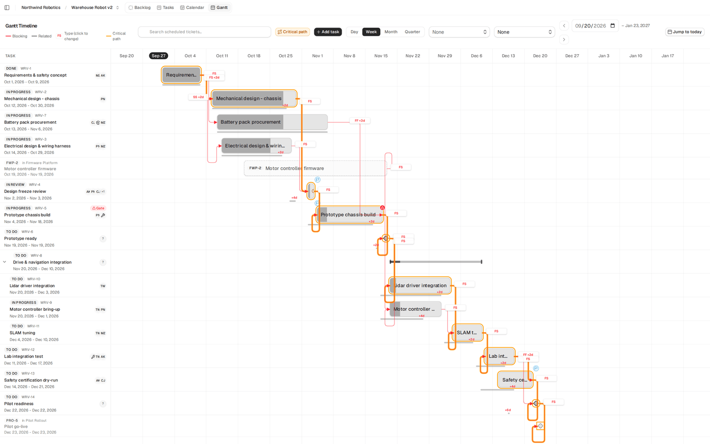
</p>

## About

Kaneo Pro is an independent fork of [Kaneo](https://github.com/usekaneo/kaneo), the fast, minimal, self-hosted project management platform. It keeps everything Kaneo offers (board, list, backlog and calendar views, integrations, the MCP server, Docker and Helm deployment) and adds what teams need to plan work over time across many projects and people.

Kaneo Pro is not affiliated with or endorsed by the Kaneo team. It is based on upstream `main` of 2026-09-26 and takes in upstream changes through a weekly sync (see [Staying in sync with upstream](#staying-in-sync-with-upstream)).

This page covers what Kaneo Pro adds. For everything the two share, see the [Kaneo documentation](https://kaneo.app/docs/core). All screenshots show fictional demo data.

## Kaneo vs Kaneo Pro

| | Kaneo | Kaneo Pro |
| --- | --- | --- |
| **Gantt chart** | Timeline with draggable, resizable task bars | Adds dependency lines and types (FS, SS, FF, SF) with lag, critical path, progress, milestones, baselines, summary bars, auto-rescheduling, date constraints, pan and zoom, Day/Week/Month/Quarter scale |
| **Cross-project work** | – | Dependencies between projects of one workspace, a critical path that follows them, and a Portfolio timeline of all projects |
| **Capacity** | – | Workload view per person and resource |
| **Activity** | Per task | Workspace-wide feed with field-level schedule changes, project filter, CSV/JSON export and retention |
| **Working calendar** | – | Working weekdays and holidays per workspace |
| **Custom fields** | Per project | Also per workspace, inherited by every project; colored options that drive Gantt colors |
| **Assignees** | One user per task | Several per task, including resources without an account (people, equipment, material) |
| **Approval gates** | – | Approval status and note per task, with warnings on the tasks it blocks |
| **Project access** | Every workspace member sees every project | Project membership with its own role, applied across the API and realtime |
| **Adding people** | Invite by email | Invite by email or add an existing account, in one dialog for workspaces and projects |
| **MCP** | Tools for tasks, projects and labels | 11 more tools and a setup page with copy-ready client commands |

## Features

### Scheduling on the Gantt chart

The Gantt chart becomes a planning tool, not just a view of dates.

- **Dependencies you can see and draw.** Drag from a bar's link handle to another task. Each line shows its type and lag.
- **Four dependency types with lag:** finish-to-start (FS), start-to-start (SS), finish-to-finish (FF) and start-to-finish (SF). Click a label to change it.
- **Auto-rescheduling.** Move or resize a task, and its dependents move forward onto working days.
- **Critical path**, with slack counted in working days. It follows dependencies into other projects.
- **Progress and milestones.** Type an exact percentage or update many tasks at once. Mark any task as a milestone.
- **Baselines.** Save a baseline, and each bar shows how far its task has slipped.
- **Summary bars** for parent tasks, with duration-weighted progress. Collapse and expand the subtasks.
- **Date constraints:** start no earlier than (SNET), finish no later than (FNLT), must start on (MSO).
- **Navigation.** Drag to pan, scroll to zoom, and switch between Day, Week, Month and Quarter. The default scale fits the project's date span. Add tasks directly on the chart.
- **At a glance.** Owner avatars, overdue markers, bar colors from the first label or a dropdown custom field, and an optional custom-field column.
- **Large projects.** Rows are virtualized, so long plans stay responsive.

<p align="center">
  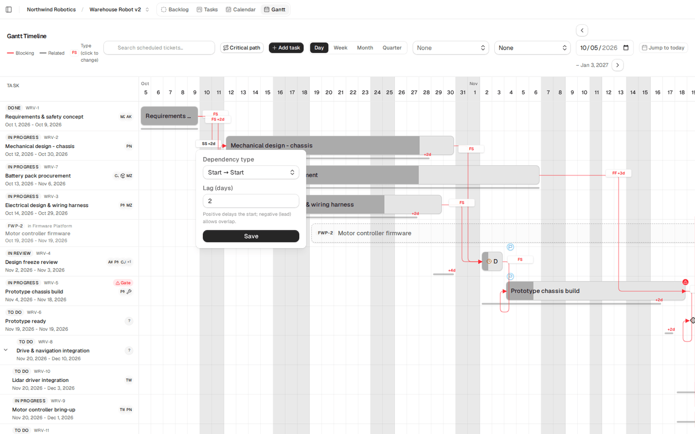
  <br /><sub>Edit a dependency's type and lag. Shaded columns are weekends and holidays from the working calendar.</sub>
</p>

### Portfolio and cross-project dependencies

- **Portfolio** shows every project of the workspace on one timeline, with a summary bar per project and lines for the dependencies between projects. It pans and zooms like the Gantt chart.
- A task can block a task in another project of the same workspace. Links never cross workspaces, and the API rejects any link that would create a cycle.
- A successor from another project that has no dates yet gets a display-only position on the timeline.

<p align="center">
  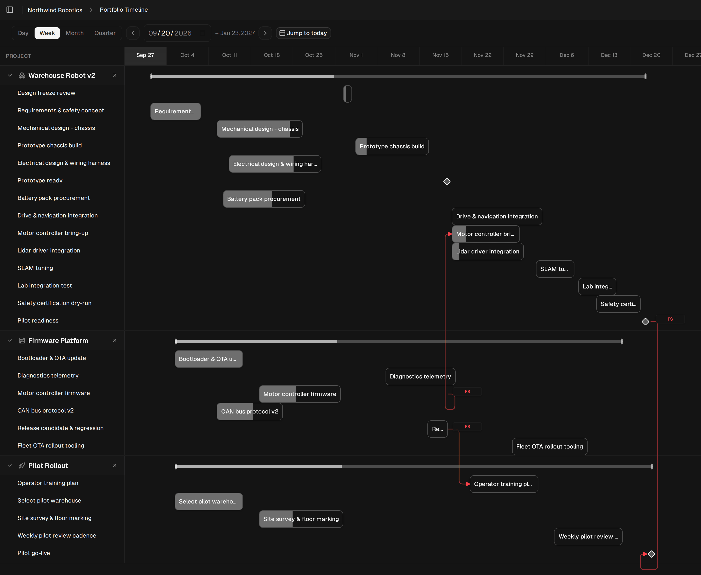
</p>

### Workload and resources

- **Workload** lists every workspace member and person resource, week by week, over a date range you choose. Cells above your threshold are highlighted, the range summary shows totals, and you can drill into the tasks behind each number.
- **Resources** are people, equipment and material without an account. Assign them to tasks just like users.
- **Invite a person resource.** When they accept, the resource links to their account and its assignments move over (in the projects the account can open). Workload then shows one row for both.

<p align="center">
  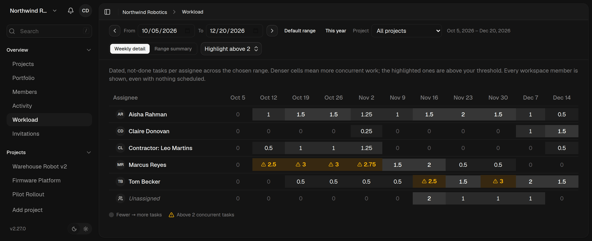
</p>

<p align="center">
  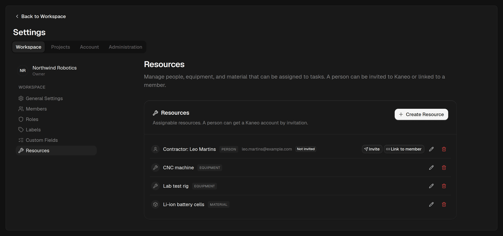
</p>

### Workspace activity

- One feed for all projects, with field-level changes (for example, the old and the new due date) and a project filter.
- Export to CSV or JSON.
- A retention period per workspace. A daily job removes older entries.
- Changes to the working calendar are logged too.

<p align="center">
  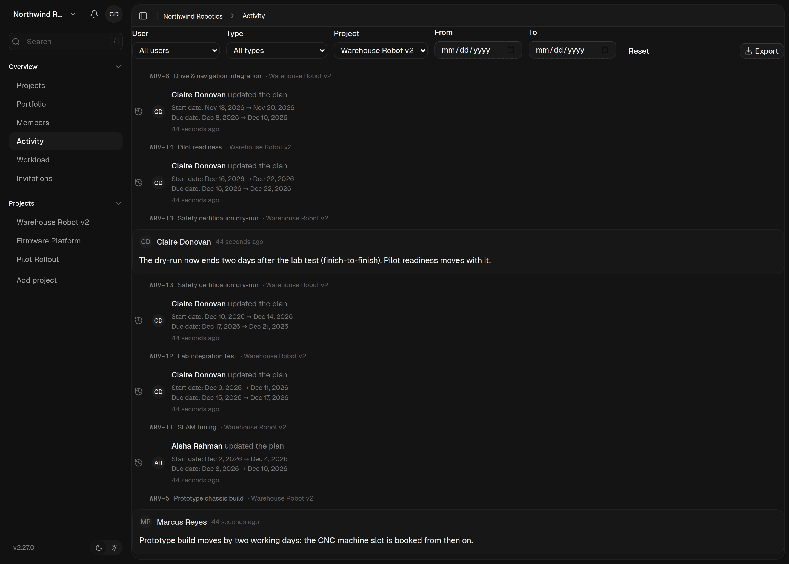
</p>

### Working calendar

Set the working weekdays and holidays of a workspace. The Gantt chart shades non-working days, and auto-rescheduling lands dependents on working days. MCP tools can read and change the calendar.

<p align="center">
  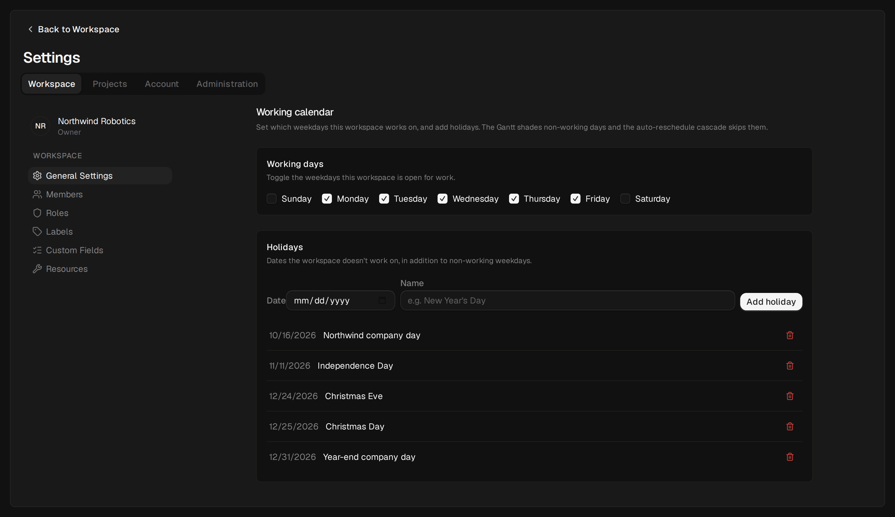
</p>

### Workspace custom fields

- Define a custom field once for the whole workspace. Every project inherits it and can hide it.
- Dropdown options have colors. The Gantt chart can color its bars by them and show the field in a column.

<p align="center">
  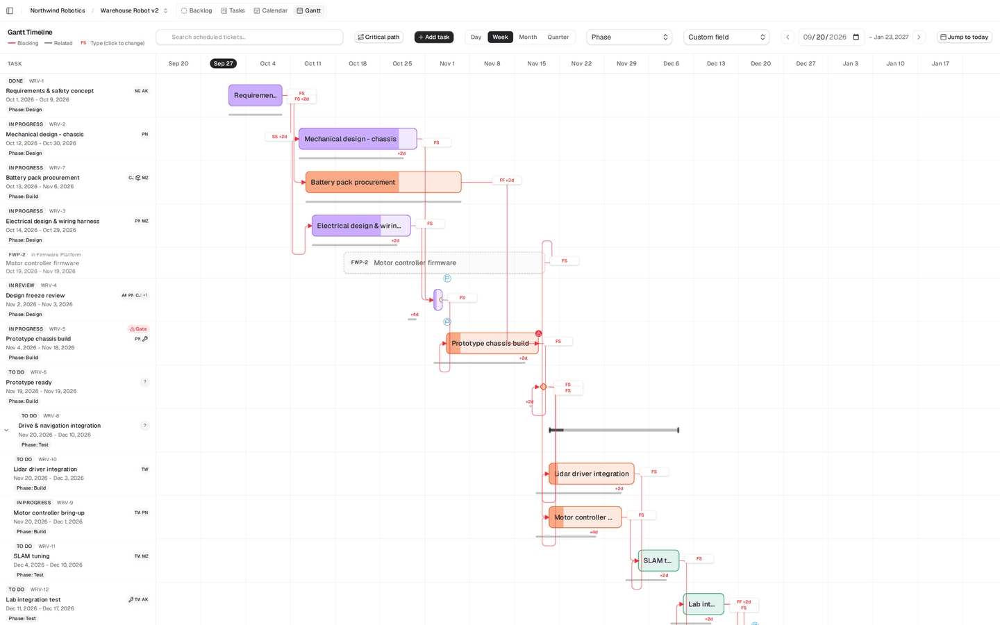
  <br /><sub>Bars colored by the workspace field “Phase” (Design, Build, Test).</sub>
</p>

<p align="center">
  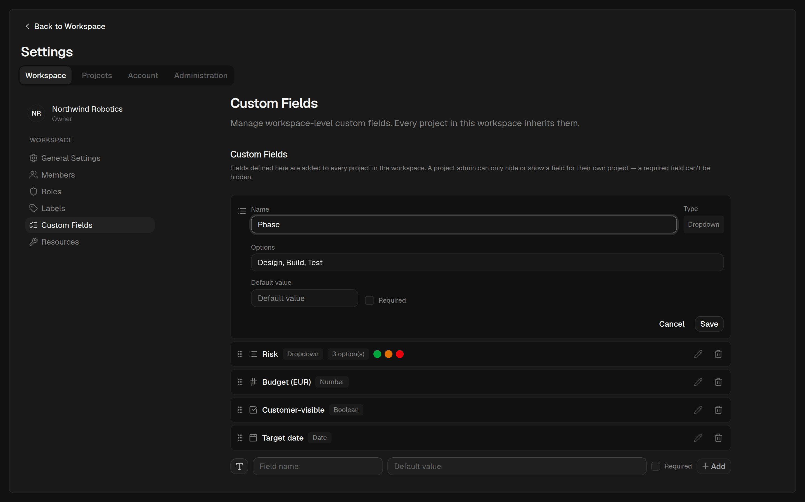
</p>

### Tasks

- **Multiple assignees**, including resources. The first assignee stays in the original `assignee` field, so existing integrations keep working.
- **Approval gates.** A task can need approval (pending, approved or rejected), with a note. Tasks that an unapproved gate blocks get a warning on the Gantt chart. MCP and task exports include the approval fields.
- **Date constraints, progress, milestones and baselines** are all in the task panel.
- A visible menu button for task actions, next to the right-click menu.
- A connection-lost notice instead of silently empty views.

<p align="center">
  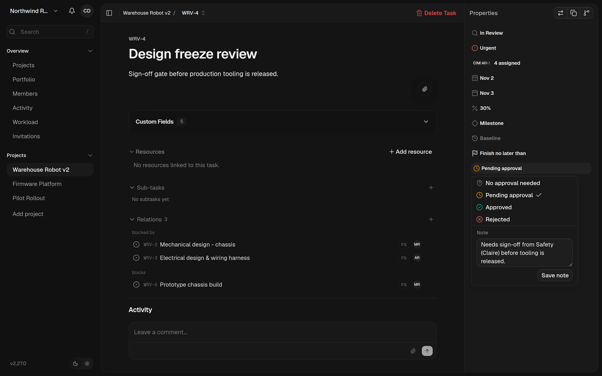
</p>

<p align="center">
  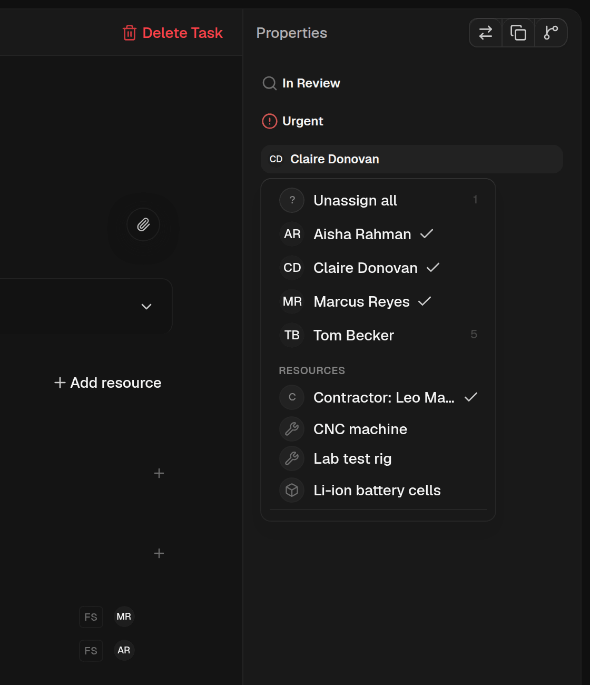
  <br /><sub>Several assignees and a resource on one task.</sub>
</p>

### Project-level access

In Kaneo, every workspace member sees every project. In Kaneo Pro, access to a project comes from membership in that project.

- **Full access:** the workspace owner, instance administrators and any role with `workspace:manage_settings` (the built-in `admin` has it). They see every project.
- **Everyone else** sees only the projects they belong to. Each membership has a project role (`viewer`, `member`, `admin` or a custom role), which can differ from the person's workspace role.
- **Enforced by the API.** Project lists, Portfolio, search, workload, activity, labels, relations, subtask counts, notifications, assignee checks and exports are filtered by project access. MCP clients and API keys use the same routes, so they get the same filtering.
- **Realtime.** WebSocket connections re-check access every 60 seconds. Removing someone from a project or a workspace closes their open connections at once.
- **Project invitations.** The inviter picks a workspace role and a project role, never above their own. Invitations are rate-limited and can be re-sent.
- **Add people.** One dialog and one people table for workspaces and projects: invite by email, or add an existing account without an invitation. The person gets an in-app notification and, when SMTP is configured, an email.

<p align="center">
  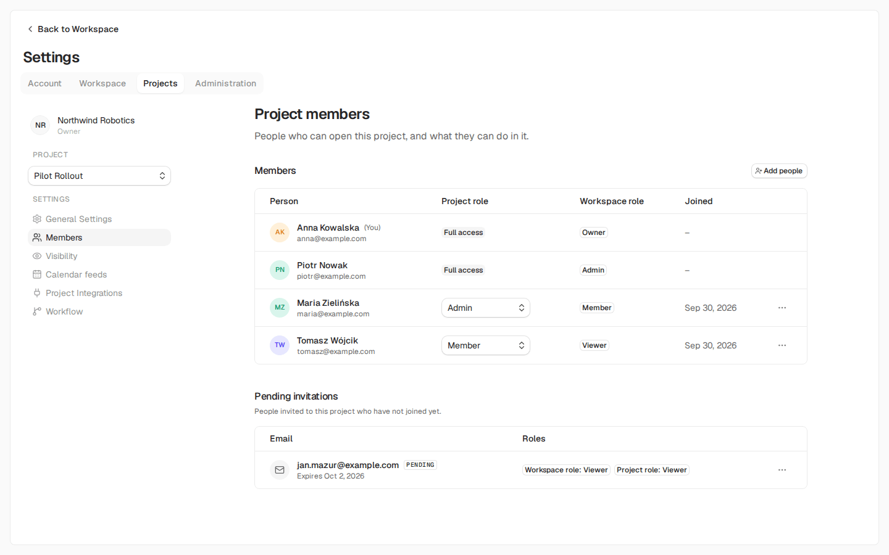
  <br /><sub>A project role can differ from the workspace role. Pending project invitations are listed below.</sub>
</p>

<p align="center">
  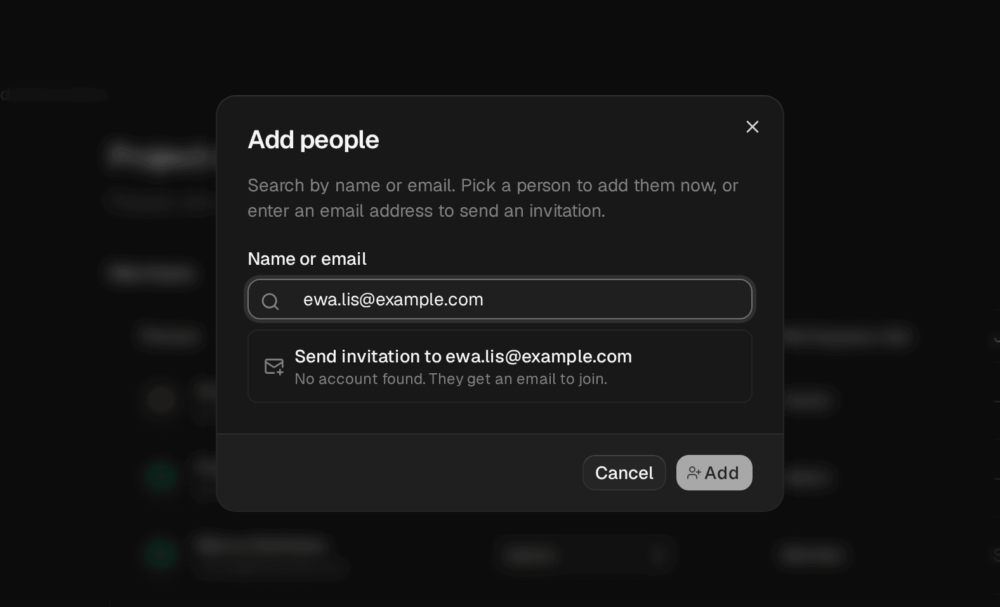
</p>

### MCP for AI agents

**Settings → Account → Developer → MCP** shows the MCP endpoint of your instance and copy-ready setup for Claude Code, Codex, Claude Desktop and claude.ai, JSON-config clients such as Cursor, and the `@kaneo/mcp` stdio package. The endpoint signs in through OAuth in the browser, so the commands contain no token.

<p align="center">
  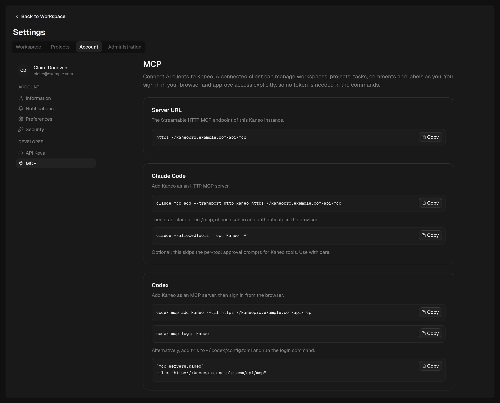
</p>

New MCP tools:

| Tool | What it does |
| --- | --- |
| `list_project_custom_fields`, `get_task_custom_fields`, `set_task_custom_field_value` | Read and write custom fields |
| `set_task_baseline`, `clear_task_baseline` | Save or clear a task's baseline |
| `update_task_assignees` | Replace a task's assignees |
| `update_task_relation` | Change a dependency's type and lag |
| `get_workspace_calendar`, `update_workspace_working_days`, `add_workspace_holiday`, `delete_workspace_holiday` | Manage the working calendar |

`get_task` and `list_tasks` also return custom fields, and `create_task` and `update_task` accept progress, milestone, date constraint and approval fields.

## Quick start

> [!NOTE]
> Kaneo Pro has no versioned releases yet. `ghcr.io/wmp/kaneo:main` is a preview image of the latest `main` commit, and it is published without waiting for CI. For anything beyond a trial, pin `ghcr.io/wmp/kaneo:sha-<short commit>` of a commit whose CI passed, or [build the image yourself](#build-the-image-yourself).

### Docker Compose

Save this as `compose.yml`:

```yaml
services:
  postgres:
    image: postgres:16-alpine
    env_file:
      - .env
    environment:
      POSTGRES_USER: ${POSTGRES_USER:-kaneo}
      POSTGRES_DB: ${POSTGRES_DB:-kaneo}
    volumes:
      - postgres_data:/var/lib/postgresql/data
    restart: unless-stopped
    healthcheck:
      test: ["CMD-SHELL", 'pg_isready -U "$${POSTGRES_USER}" -d "$${POSTGRES_DB}"']
      interval: 10s
      timeout: 5s
      retries: 5

  kaneo:
    image: ghcr.io/wmp/kaneo:main
    ports:
      - "5173:5173"
    env_file:
      - .env
    depends_on:
      postgres:
        condition: service_healthy
    restart: unless-stopped

volumes:
  postgres_data:
```

Save [`.env.sample`](.env.sample) as `.env` next to it. Check that `KANEO_CLIENT_URL=http://localhost:5173` is set, and set `POSTGRES_PASSWORD` and `AUTH_SECRET` (use the output of `openssl rand -hex 32`). Then run `docker compose up -d` and open [http://localhost:5173](http://localhost:5173).

> [!IMPORTANT]
> `compose.yml`, `compose.coolify.yml` and the Helm chart in this repository still default to the upstream image `ghcr.io/usekaneo/kaneo`. Set the Kaneo Pro image as shown here, or you run upstream Kaneo.

### Kubernetes (Helm)

Use the chart from this repository, because it has the Kaneo Pro settings (such as `kaneo.env.disableUserDirectory`):

```bash
git clone https://github.com/WMP/kaneo.git kaneo-pro
helm install kaneo ./kaneo-pro/charts/kaneo \
  --namespace kaneo --create-namespace \
  --set kaneo.image.repository=ghcr.io/wmp/kaneo \
  --set kaneo.image.tag=main
```

See the [chart documentation](charts/kaneo/README.md) for ingress, TLS and production values.

### Build the image yourself

```bash
git clone https://github.com/WMP/kaneo.git kaneo-pro
cd kaneo-pro
docker build -f Dockerfile.kaneo -t kaneo-pro:local .
```

Then use `image: kaneo-pro:local` in the Compose file. CI builds the same Dockerfile for every pull request.

### Local development

```bash
pnpm install
cp .env.sample .env   # set DATABASE_URL, AUTH_SECRET and KANEO_CLIENT_URL
pnpm dev              # API on port 1337, web app on port 5173
```

Use Node.js 24 and pnpm 10.32.1. See the [environment setup guide](ENVIRONMENT_SETUP.md). Contributors and coding agents start with [AGENTS.md](AGENTS.md).

## Configuration

Kaneo Pro uses the Kaneo configuration described in [ENVIRONMENT_SETUP.md](ENVIRONMENT_SETUP.md), plus these variables:

| Variable | Default | Effect |
| --- | --- | --- |
| `DISABLE_USER_DIRECTORY` | `false` | `true` turns off the account search in "Add people". People can still be invited by email. Helm: `kaneo.env.disableUserDirectory`. |
| `ENABLE_USER_DIRECTORY` | `false` | With `KANEO_CLOUD=true`, the account search stays off unless this is `true`. |
| `ACTIVITY_RETENTION_ENABLED` | enabled | `false` pauses the daily job that deletes activity older than each workspace's retention setting. |

## Upgrading from Kaneo

> [!WARNING]
> Back up your database before you switch an existing Kaneo installation to Kaneo Pro, and read this section first.

- **Base version.** Kaneo Pro is based on upstream `main` of 2026-09-26 (after v2.27.0, before v2.28.0). Newer upstream changes arrive through the weekly sync pull request. Until they are merged, moving from Kaneo v2.28 or later drops the upstream changes made since that date.
- **Tested path.** The CI step "Upgrade from the latest stable release" starts the latest upstream release (v2.29.3 at the time of writing), seeds an account, a workspace membership, a project, a task, a comment and a private image, then starts Kaneo Pro on the same database. It checks that this data is intact and that writes still work.
- **Migrations.** Kaneo Pro adds its own migrations `0051` to `0058` (tables and columns prefixed `ganttpro_`), so after `0050` the numbering differs from upstream. On start-up, the API reconciles the migration journal of a database that already has the schema, so that only the missing migrations run.
- **Not carried over: project backgrounds and calendar feeds.** Kaneo v2.28 and later store them in `project.background_*` and `calendar_feed`. Kaneo Pro uses `project.ganttpro_background_*` and `ganttpro_calendar_feed`, and its migrations do not copy the data. The old data stays in the database, but Kaneo Pro does not show it: set the backgrounds again and create new calendar feed links after the upgrade.
- **Project access changes.** Migration `0056` creates no project memberships. Workspace owners, instance administrators and roles with `workspace:manage_settings` keep access to every project. **All other members (`member`, `viewer` and custom roles) lose access to the existing projects until an administrator adds them.**
- **User directory.** "Add people" can search every account on the instance by name and email, which reveals that an account exists. On an instance where anyone can sign up, set `DISABLE_USER_DIRECTORY=true`, `DISABLE_WORKSPACE_CREATION=true`, or both.

## Known limitations

The [project decisions](docs/agent-guide/project-decisions.md) describe the target, and the [invariant index](docs/agent-guide/invariants.md) records what is enforced today. The main open points:

- The browser calculates auto-rescheduling. The API validates dates, but not the dependency graph (KAN-SCHED-005).
- Moving a task and shifting its dependents are two requests, not one transaction (KAN-SCHED-006).
- Auto-rescheduling does not move dependents in other projects (KAN-SCHED-007). The critical path and the dependency lines do include them.
- Calendar feeds are not tied to their creator, so a feed keeps working after its creator loses access to the project.
- Workspace resources are listed to every workspace member, whatever their project access.
- Preview images are published without waiting for CI (KAN-RELEASE-001).

## Staying in sync with upstream

- A weekly workflow ([upstream-sync.yml](.github/workflows/upstream-sync.yml)) fetches upstream `main` and, when there is something new, opens one pull request. A person resolves the conflicts, and the pull request reports clashing migration numbers.
- This README is specific to Kaneo Pro. When a sync pull request conflicts on `README.md`, keep this version.
- CI runs on GitHub-hosted runners and includes the upgrade test from the latest upstream release.
- The [agent guide](docs/agent-guide/README.md) holds the contracts, invariants and verification steps for changes.

## License

MIT, like Kaneo. See [LICENSE](LICENSE).
